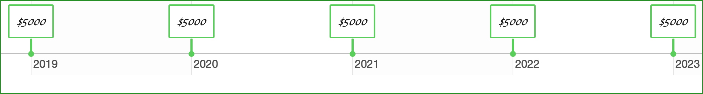

```{r, include = FALSE}
library(timevis)
library(lubridate)
library(htmltools)
library(webshot)
library(magick)
```

# Present Value {#Present-Value}


## The Time Value of Money

<!-- https://github.com/daattali/timevis/issues/45 -->
```{r Cashflow-Diagram, echo = FALSE}
# Create data to plot
data <- data.frame( start = c( ymd(20190101), ymd(20200101), 
                               ymd(20210101), ymd(20220101),
                               ymd(20230101) ),
                    content = c( "$5000", "$5000", "$5000", "$5000", "$5000" ) )

style <- "
.vis-timeline {
  border-color: #269026;
  background-color: #FFFFFF;
  font-size: 15px;
  color: green;
}

.vis-item {
  border: 2px solid #5ace5a;
  font-size: 12pt;
  background: #FFFFFF;
  font-family: cursive;
  padding: 5px;
}
"
tv <- timevis(data = data, showZoom = FALSE, 
              fit = TRUE, zoomFactor = 1,
              options = list( showCurrentTime = FALSE,
                              zoomable = FALSE) )
tv <- tagList(tags$style(style), tv)
tv <- htmltools::html_print(tv)
tv <- webshot::webshot(url=tv, zoom=2)
tv <- magick::image_read("webshot.png")
tv <- magick::image_trim(tv)
magick::image_write(tv, "webshot.png", "png")


```

## Finding Present Value 


##
